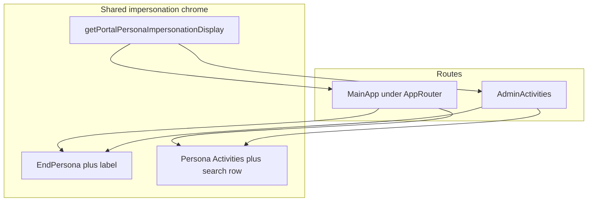

# Fix impersonation landing on Admin activities

## Root cause

In [`awesomeportal-react/src/components/MainApp.tsx`](awesomeportal-react/src/components/MainApp.tsx), a `useEffect` auto-navigates org admins (and similar roles) from `/` to `/admin/activities` after a configurable delay (default **3500ms** via [`readPostLoginAdminRedirectDelayMs`](awesomeportal-react/src/utils/portalSession.ts)):

```565:573:awesomeportal-react/src/components/MainApp.tsx
    useEffect(() => {
        if (!shouldOpenAdminActivitiesAfterSignIn(accessToken)) return;
        if (location.pathname !== '/' && location.pathname !== '/index.html') return;
        const delayMs = readPostLoginAdminRedirectDelayMs();
        const id = window.setTimeout(() => {
            navigate('/admin/activities', { replace: true });
        }, delayMs);
        return () => window.clearTimeout(id);
    }, [accessToken, location.pathname, navigate]);
```

[`shouldOpenAdminActivitiesAfterSignIn`](awesomeportal-react/src/utils/portalAccess.ts) returns false when [`setSkipAdminLandingRedirect(true)`](awesomeportal-react/src/utils/portalAccess.ts) has set session storage — which **impersonation already calls** in the MainApp modal handler:

```1364:1368:awesomeportal-react/src/components/MainApp.tsx
                            onSelectPersona={(p) => {
                                setSkipAdminLandingRedirect(true);
                                applyPortalPersona(p, { markPersonaPreviewStrip: true });
                                setPersonaImpersonateModalOpen(false);
                            }}
```

The problem: the effect’s dependency array is only `[accessToken, location.pathname, navigate]`. Choosing a persona does **not** change those values, so the effect **does not re-run**, its cleanup **never runs**, and a timer that was started when the user first hit `/` (with skip still false) **still fires** and calls `navigate('/admin/activities')` even after impersonation set the skip flag.

That matches “I picked a role but still ended up on Admin activities,” especially from the main portal on `/` with the default multi-second delay.

[`AdminActivities.tsx`](awesomeportal-react/src/pages/AdminActivities.tsx) navigates to `/`, which **does** change `location.pathname` and clears any pending timer — that path is less likely to hit this bug.

## Recommended fix (minimal)

In the same `useEffect` in `MainApp.tsx`, **re-check** eligibility inside the `setTimeout` callback immediately before `navigate`:

- Call `shouldOpenAdminActivitiesAfterSignIn(accessToken)` again (it reads `readSkipAdminLandingRedirect()` from sessionStorage at call time).
- Optionally also confirm `location.pathname` is still `/` or `/index.html` (belt-and-suspenders if something else navigated away).

If the re-check fails, return without navigating. No new state or extra dependencies required; this is a small, targeted change.

## Optional follow-up (only if you want stricter “home” semantics)

Impersonation’s [`applyPortalPersona`](awesomeportal-react/src/components/MainApp.tsx) clears tile/DA URLs but does **not** clear `selectedAppId`, so an admin could still be inside **Files** or another embedded surface after picking a persona. If product intent is “always show the persona’s portal home shell,” consider also clearing `selectedAppId` (or navigating with the same pattern as the **Home** rail / `goPortalAppsShell`) in the impersonation path only — separate from the redirect bug above.

## Verification

- As an org admin: land on `/`, wait &lt; delay, open **View portal as**, pick a non-admin persona before the delay elapses — you should **remain** on the main portal persona experience, not be redirected to `/admin/activities`.
- Regression: first visit to `/` after sign-in with no impersonation should still auto-open Admin activities when skip is not set.

---

## Sticky impersonation chrome + `{Persona} Activities` top row (new scope)

### Current behavior (why it feels broken)

- **End Persona** and the impersonated name live only in [`HeaderBar.tsx`](awesomeportal-react/src/components/HeaderBar.tsx), wired from [`MainApp.tsx`](awesomeportal-react/src/components/MainApp.tsx) via `headerPersonaImpersonation` (see ~1288–1327). [`AdminActivities.tsx`](awesomeportal-react/src/pages/AdminActivities.tsx) is a **separate route** with its own `admin-shell-topbar` and **does not render `HeaderBar`**, so opening Admin activities (or being redirected there) drops the impersonation strip entirely.
- The **persona-colored mark**, **`{Persona} Activities` title**, and **search icon + field** exist only in Admin activities’ topbar (~236–258 in `AdminActivities.tsx`). In MainApp, the functional [`SearchBar`](awesomeportal-react/src/components/MainApp.tsx) sits **inside** the assets-browser branch (~1605+) inside `.portal-workspace-main-scroll`, so it disappears on **Home / Apps / Files / grid** even though the admin shell visually matches Admin activities elsewhere.

### Target UX

1. **Persist**: Glyph + impersonated persona label + **End Persona** stay at the top while moving across rail destinations (Home, Apps, Files, Assets, tiles) and when visiting **`/admin/activities`**.
2. **Match admin header row**: While impersonation is active, show the same **mark + `{PORTAL_PERSONA_LABELS[persona]} Activities` + search** pattern as [`AdminActivities`](awesomeportal-react/src/pages/AdminActivities.tsx) (disabled placeholder search is acceptable for non-assets views to avoid a large search refactor in pass 1; assets can keep the existing in-body `SearchBar` or optionally be wired later into the sticky row).

### Implementation approach

- **Shared “impersonation active” rule** (same as `headerPersonaImpersonation` today): user may impersonate (`canImpersonatePortalPersonas`), IMS-derived persona exists, and either `getSelectedPersona() !== imsDerivedPersona` or [`readPortalPersonaPreviewStripActive()`](awesomeportal-react/src/utils/portalSession.ts). Extract a small helper (e.g. `getPortalPersonaImpersonationDisplay(accessToken)` → `{ active, effectivePersonaId, label } | null`) in [`portalAccess.ts`](awesomeportal-react/src/utils/portalAccess.ts) or next to existing IMS helpers so **MainApp** and **AdminActivities** stay consistent.
- **Sticky layout**: Apply **`position: sticky; top: 0`** (with **`z-index`**) to the global header stack so it stays visible if the outer document scrolls; confirm [`MainApp.css`](awesomeportal-react/src/MainApp.css) `.container` / parents do not prevent stacking. If two rows (HeaderBar + persona activities bar), either one sticky wrapper containing both or second row with `top` offset under the first.
- **MainApp**: When impersonation is active, render a topbar block **between** `HeaderBar` and `.admin-shell.portal-workspace-root` (or first row inside the shell) reusing **`admin-shell-topbar` / `admin-shell-topbar-brand` / `admin-shell-search`** classes from [`AdminActivities.css`](awesomeportal-react/src/pages/AdminActivities.css) so look-and-feel matches. Drive `persona-*` modifier classes from `portalPersona`.
- **AdminActivities**: When the shared helper says impersonation is active, render the same **HeaderBar** impersonation props **or** a compact duplicate strip in the topbar actions area, and wire **End Persona** to the same behavior as [`handleEndPersonaImpersonation`](awesomeportal-react/src/components/MainApp.tsx) (clear preview strip, restore IMS-derived persona in storage/state, navigate to neutral admin workspace — consider extracting a shared `endPortalPersonaImpersonation(navigate)` to avoid drift). Optionally set `?persona=` on the admin URL when impersonating so the existing “persona from URL” title logic aligns with the impersonated role.
- **Accessibility**: Preserve `aria-label` patterns already used on the admin topbar brand (~241 in `AdminActivities.tsx`).



### Verification (added)

- Impersonate, then switch **Home / Apps / Files / Assets / a tile**: impersonation strip and **Activities** top row remain; scroll main content where applicable — chrome stays pinned as specified.
- From impersonation, open **Admin activities**: strip + top row still present; **End Persona** still works.
