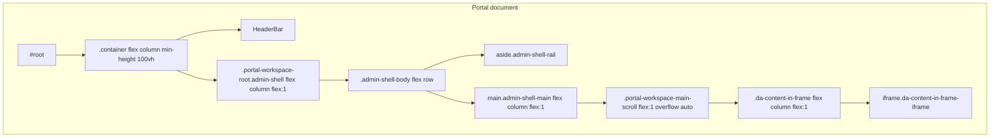

# Full-screen workspace iframe (tile / hosted URL)

## What is going wrong

- The DOM you shared (`header.global-navigation`, `main`, `footer.global-footer`, Grammarly `data-gr-ext-*` on `body`) is the **child document** loaded in the portal’s workspace iframe when a grid tile opens a URL like the Frame.io marketing page.
- That page is **not** broken on adobe.com; it is constrained by the **parent** iframe box. If the iframe resolves to a small height (common when a nested flex column has `min-height: auto` / missing height propagation, or when the scroll parent uses `overflow: auto` without a definite flex size), the embedded site’s layout viewport is tiny—often described as “only a quarter of the screen.”

- Today, [`portal-workspace-root.admin-shell`](awesomeportal-react/src/MainApp.css) **intentionally differs** from standalone [`admin-shell`](awesomeportal-react/src/pages/AdminActivities.css): the portal variant uses `flex: 1` + `min-height: 0` under `.container` instead of pinning `height: 100vh` on the shell. If any link in the chain above `.da-content-in-frame` fails to pass a **definite block size** into the flex child, the iframe’s used height collapses toward its intrinsic minimum (often ~150px in older behavior) or another small value.

## Recommended fix (incremental, low risk)

1. **Pin the app root to the viewport** in [`awesomeportal-react/src/index.css`](awesomeportal-react/src/index.css) (or a tiny addition in [`MainApp.css`](awesomeportal-react/src/MainApp.css)):
   - `html, body { height: 100%; margin: 0; }` (margin already on `body`)
   - `#root { min-height: 100dvh; display: flex; flex-direction: column; }` so routed content (including `MainApp`) can use `flex: 1` reliably.

2. **Make the portal shell fill `#root`** in [`MainApp.css`](awesomeportal-react/src/MainApp.css):
   - On `.container`, add `flex: 1` and `min-height: 0` (in addition to existing `min-height: 100vh`) so it is a proper flex child of `#root` and passes height down.

3. **Embed-specific tightening** when the workspace shows an iframe ([`showWorkspaceIframe`](awesomeportal-react/src/components/MainApp.tsx) / `selectedDaContentUrl`):
   - Add a class on `portal-workspace-main-scroll` or `main.portal-workspace-main` when embed is active, e.g. `portal-workspace-main-scroll--embed`, set in [`MainApp.tsx`](awesomeportal-react/src/components/MainApp.tsx) next to the existing iframe branches.
   - In CSS for that modifier:
     - `overflow: hidden` on the scroll wrapper (avoid the iframe living inside a scrollable flex region that never receives a stable height).
     - Ensure `.da-content-in-frame` and (for the clip variant) `.da-content-in-frame-clip` keep `flex: 1; min-height: 0`.
     - On `.da-content-in-frame-iframe`, set `align-self: stretch` and `min-height: 0` if needed so the replaced element participates correctly as a flex item (non-clipped path).

4. **Clipped embed path** ([`.da-content-in-frame--clip-embedded-top-app-bar`](awesomeportal-react/src/MainApp.css)): the iframe is `position: absolute` inside `.da-content-in-frame-clip`; that wrapper **must** get a non-zero height from its flex parent. After step 3, re-test; if the clip wrapper still collapses, set an explicit `min-height: 0` + `flex: 1` on `.da-content-in-frame` and verify `.da-content-in-frame-clip` has `flex: 1` or `height: 100%` consistent with the non-absolute child rules.

5. **Optional stronger guarantee** if flex alone is still flaky on a target browser: for embed mode only, use a `position: fixed` (or `sticky`) panel for the iframe area anchored to `inset` values that account for the rail width and header height, or set a single CSS variable `--portal-embed-height: calc(100dvh - <header+rail estimate>)` on `html` from a small `ResizeObserver` in `MainApp`—only if CSS-only fix is insufficient.

## Verification

- Local: open a tile pointing at `https://www.adobe.com/creativecloud/business/frameio.html` (or your failing URL), confirm in DevTools **parent** document: computed height of `iframe` and `.da-content-in-frame` ≈ viewport minus portal chrome.
- Regression: grid home, Assets browser, Files embed, and admin routes still layout correctly; no double scrollbars unless the **inner** site intentionally scrolls.

## Out of scope / constraints

- You **cannot** change the pasted Adobe `body` markup from the parent app (cross-origin). All fixes are in the portal shell CSS/markup above the iframe.
- If the target sends `X-Frame-Options` / CSP and refuses embedding, the existing fallback UI remains the only option.
