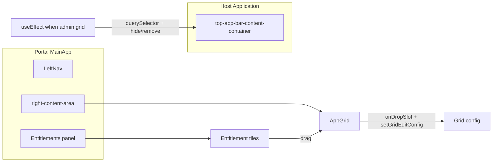

# Admin Screen: Adobe Entitlements Column and Layout Changes

## Scope

- **Where**: Admin home view in [MainApp.tsx](awesomeportal-react/src/components/MainApp.tsx) (the branch that renders the view toggle, edit bar, and `AppGrid`).
- **Layout**: Add a third column to the right of `right-content-area` (so `main-content-layout` becomes: LeftNav | right-content-area | **entitlements panel**).
- **Host element**: Hide/remove the host-provided element with class `top-app-bar-content-container` when the portal is in the admin grid view (so it does not conflict with the new layout).

## 1. Layout: New column and hide host bar

- **MainApp.tsx**
  - In the `main-content-layout` div (~1016), after the closing `
` of `right-content-area`, add a new column that renders only when:
    - User is **authenticated**, and
    - We are in the **grid view** (same condition as the current `else` that renders the view toggle + AppGrid: not Assets Browser, not Dashboard, not DA frame, not firefly/experience-hub/ai-agents full view), and
    - Optionally restrict to **admin** viewMode so the panel only shows when Admin is selected.
  - Add a `useEffect` (or ref + effect) that, when that same “admin grid” view is active, finds the host element by class `top-app-bar-content-container` (e.g. `document.querySelector('.top-app-bar-content-container')`) and either:
  - Sets `style.display = 'none'`, or
  - Removes the node from the DOM.
  - On cleanup (or when leaving that view), restore the element (e.g. set `display` back or re-append if we stored the parent and node).
- **MainApp.css**
  - Adjust `.right-content-area` width (e.g. from `70%` to ~55–60%) so the new column fits.
  - Add a class for the new column (e.g. `.entitlements-panel` or `.admin-entitlements-column`) with fixed or flex width (~25–30%), same min-height/overflow as the rest of the layout, and scroll if needed.

## 2. Adobe entitlements data and “slot-like” tiles

- **Entitlement list**: The portal cannot call [https://www.adobe.com/apps/all/all-platforms](https://www.adobe.com/apps/all/all-platforms) as an API; that page is for users to see their apps in the browser. Use a **curated list** of known Adobe apps that can appear as entitlements, including at least:
  - **Adobe Express**: `https://new.express.adobe.com/?showIntentQuiz=false&locale=en-US` (name, icon, short description).
  - **Adobe Firefly**: `https://firefly.adobe.com/?promoid=L3XTTKDX&locale=en-US&mv=other&mv2=tab`.
  - **Adobe Photoshop**: `https://photoshop.adobe.com/?promoid=LCDWT9XV&lang=en&mv=other&mv2=tab`.
- Add more entries as needed to mirror “all platforms” (e.g. Illustrator, Acrobat, etc.) with `id`, `title`, `description`, `iconUrl` or built-in icon, and `href`. Store this in a constant (e.g. in a new `constants/adobeEntitlements.ts` or inside the component that renders the panel).
- **Tile UI**: Reuse the same visual pattern as grid slots so the new tiles “look like the slots from the grid”: reuse classes from [AppGrid.css](awesomeportal-react/src/components/AppGrid.css) (e.g. `app-grid-tile`, `app-tile-icon`, `app-tile-title`, `app-tile-description`) or a small variant (e.g. `entitlement-tile` that extends the same styles). Each tile shows: **name** (title), **icon**, **short description**.

## 3. Drag-and-drop from entitlements to grid

- **Drag source**: Each entitlement tile in the new column is **draggable** (HTML5 `draggable={true}` and `onDragStart`). In `dataTransfer` pass a payload that identifies the entitlement (e.g. `application/json` with `{ id, title, description, href, iconUrl }` or a simple string id that can be looked up).
- **Drop target**: The grid in admin view must accept drops. Today [AppGrid.tsx](awesomeportal-react/src/components/AppGrid.tsx) does not handle drop. Options:
  - **Option A (recommended)**: Add an optional `onDropSlot?: (index: number, payload: EntitlementPayload) => void` (or similar) to `AppGrid`. When in admin mode and this prop is set, each grid slot (including empty slots) is a drop target (`onDragOver` preventDefault, `onDrop`). On drop, call `onDropSlot(index, payload)`.
  - **Option B**: Wrap the grid in a drop zone that accepts drops and then determines which slot was targeted (e.g. by position or a single “add to next slot” behavior).
- **Persistence**: When a slot receives a drop, MainApp (or a small helper) should convert the payload into a [SlotBlockDescriptor](awesomeportal-react/src/types/index.ts) (e.g. `slotType: 'application'`, `href`, `title`, `description`, `iconUrl`) and update the grid config: read current `getGridEditConfig()`, mutate `slotBlocks` (insert at index or replace empty slot), then `setGridEditConfig()`. That keeps the grid in sync with [useSlotBlocks](awesomeportal-react/src/hooks/useSlotBlocks.tsx) which reads from `getExternalParams()` / saved config.

## 4. When the panel is shown

- Show the new column only when:
  - `authenticated === true`, and
  - The current route/content is the **home grid** (not Assets Browser, not Dashboard, not DA iframe, not a selected tile full view), and
  - `viewMode === 'admin'` (so creators don’t see the drag sources).
- Hide host bar only in that same state so the host’s “top-app-bar-content-container” is hidden only when the admin entitlements panel is visible.

## 5. Files to add or touch

| Area                            | File                                                                | Changes                                                                                                                                                      |
| ------------------------------- | ------------------------------------------------------------------- | ------------------------------------------------------------------------------------------------------------------------------------------------------------ |
| Layout + column + hide host bar | [MainApp.tsx](awesomeportal-react/src/components/MainApp.tsx)       | Add third column; conditional render; useEffect to hide/remove `.top-app-bar-content-container` when in admin grid view; wire `onDropSlot` to config update. |
| Styles                          | [MainApp.css](awesomeportal-react/src/MainApp.css)                  | `.right-content-area` width; new `.entitlements-panel` (or similar) for the column.                                                                          |
| Grid DnD                        | [AppGrid.tsx](awesomeportal-react/src/components/AppGrid.tsx)       | Optional `onDropSlot(index, payload)`; make tiles/slots drop targets when provided.                                                                          |
| Grid styles                     | [AppGrid.css](awesomeportal-react/src/components/AppGrid.css)       | Optional: drop target highlight (e.g. border when dragging over).                                                                                            |
| Data                            | New file or [config/utils](awesomeportal-react/src/utils/config.ts) | Curated list of Adobe entitlements (Express, Firefly, Photoshop, etc.) with id, title, description, href, icon.                                              |
| Types                           | [types/index.ts](awesomeportal-react/src/types/index.ts)            | Optional: `EntitlementPayload` or reuse `SlotBlockDescriptor` for drag payload.                                                                              |

## 6. Flow summary

- When user is logged in and on admin grid view: hide host `top-app-bar-content-container`; show entitlements column; entitlement tiles are draggable; grid slots accept drop and persist new slots via `setGridEditConfig`.

## 7. Entitlements API (future)

Using [https://www.adobe.com/apps/all/all-platforms](https://www.adobe.com/apps/all/all-platforms) only as a **reference** for which apps exist. Showing the full set of *user* entitlements would require an Adobe API (e.g. entitlements or profile) that returns the user’s subscribed apps; that can be added later if such an API is available. For this plan, the curated list plus drag-and-drop is sufficient.