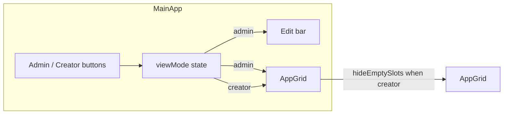

# Admin vs Creator view toggle

## Current behavior

- [MainApp.tsx](awesomeportal-react/src/components/MainApp.tsx) (lines 1067–1094): When showing the home grid, it always renders:
  - An edit bar with **Edit grid** and **Customize** buttons
  - `<AppGrid tiles={appTiles} ... />` where `appTiles` comes from `useSlotBlocks()` (can be fewer than 24 items)
- [AppGrid.tsx](awesomeportal-react/src/components/AppGrid.tsx): Pads to exactly 24 slots (`Array.from({ length: 24 }, (_, i) => tiles[i] || null)`). Null slots render as "Empty Slot" placeholders (lines 105–107). Grid CSS is fixed 4×6.

## Target behavior

| View        | Empty slots     | Edit grid button | Customize button |
| ----------- | --------------- | ---------------- | ---------------- |
| **Admin**   | Shown (current) | Shown            | Shown            |
| **Creator** | Hidden          | Hidden           | Hidden           |

## Implementation

### 1. View mode state and toggle in MainApp

- Add state: `viewMode: 'admin' | 'creator'`, default `'admin'`.
- In the **same branch** that currently renders the edit bar + AppGrid (the final `else` in the right-content-area, ~1067–1094), add a **view toggle** above the content:
  - Two buttons: **Admin** and **Creator**, which set `viewMode` to `'admin'` or `'creator'`.
  - Style consistently with existing `.app-grid-customize-btn` (or a small segmented control) so the active view is clear.
- Conditional rendering in that branch:
  - **Admin**: render the existing `
` (Edit grid + Customize) and `<AppGrid tiles={appTiles} ... />` with no new props (empty slots shown).
  - **Creator**: do **not** render the edit bar; render `<AppGrid tiles={appTiles} hideEmptySlots ... />` (and any other existing props).

### 2. AppGrid: support hiding empty slots

- Add optional prop: `hideEmptySlots?: boolean` (default `false`).
- When `hideEmptySlots === true`:
  - Build the grid list from only non-null tiles:  
  `gridTiles = tiles.filter((t): t is AppTile => t != null)`  
  (no padding to 24).
  - Add a modifier class on the grid container (e.g. `hide-empty-slots`) so CSS can adjust layout.
- When `hideEmptySlots === false`, keep current behavior: pad to 24 with nulls.

### 3. AppGrid.css: layout when only filled tiles

- For `.app-grid.hide-empty-slots` (or the chosen modifier):
  - Avoid fixed 6 rows so the grid doesn’t leave a large gap. For example:
    - `grid-template-rows: none;`
    - `grid-auto-rows: minmax(var(--app-tile-min-height, 120px), auto);`
  - Keep the same column behavior (`grid-template-columns: repeat(4, ...)`) so filled tiles wrap in a 4-column layout. Adjust responsive breakpoints (e.g. repeat(3) / repeat(2)) for the same class if needed.

## Data flow

- Same `appTiles` in both views; only visibility of empty slots and of the edit bar changes.

## Files to change

| File                                                                                             | Changes                                                                                                                                                    |
| ------------------------------------------------------------------------------------------------ | ---------------------------------------------------------------------------------------------------------------------------------------------------------- |
| [awesomeportal-react/src/components/MainApp.tsx](awesomeportal-react/src/components/MainApp.tsx) | Add `viewMode` state; view toggle buttons; conditionally render edit bar and pass `hideEmptySlots={viewMode === 'creator'}` to AppGrid in the grid branch. |
| [awesomeportal-react/src/components/AppGrid.tsx](awesomeportal-react/src/components/AppGrid.tsx) | Add `hideEmptySlots?: boolean`; when true, set `gridTiles` to filtered tiles and add modifier class to container.                                          |
| [awesomeportal-react/src/components/AppGrid.css](awesomeportal-react/src/components/AppGrid.css) | Add `.app-grid.hide-empty-slots` (or equivalent) with auto rows so the grid doesn’t reserve space for 24 cells.                                            |

## Edge cases

- **Default view**: Default to Admin so existing behavior is unchanged.
- **Persistence**: No requirement to persist view mode (session-only is fine). If you later want to remember per user, that can be a follow-up (e.g. localStorage or URL).
- **Other views**: The Admin/Creator toggle only appears when the main app grid is visible (not when a tile like Firefly or DA content is open). When returning to the grid, `viewMode` remains whatever the user last selected.

