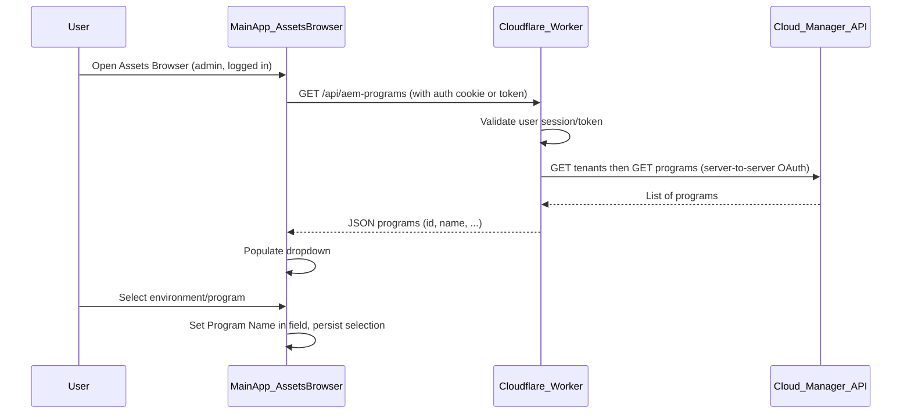

# AEM Instance Selector for Assets Browser (Admin View)

## Goal

In the Assets Browser, when the user is in **admin view** and **logged in**, add:

1. A way to **choose the AEM instance** (e.g. `https://experience.adobe.com/#/@bilbroug/experiencemanager/`) by selecting from a list of environments.
2. The list is driven by **IMS Org's AEMaaCS Cloud entitlements** (programs/environments).
3. After selection, **Program Name** is shown in a dedicated field.

No edits or non-readonly tools will be performed until you confirm this plan.

## Current state

- **Assets Browser** is the left-nav app whose content is rendered in [MainApp.tsx](awesomeportal-react/src/components/MainApp.tsx) when `selectedAppId === 'assets-browser'` (or path includes `/tools/assets-browser/index.html`). Content is the search bar, breadcrumbs, gallery, and facets (lines 999–1034). There is no existing “AEM instance” or “environment” selector.
- **Bucket** (which backend the assets browser uses) comes from [getBucket()](awesomeportal-react/src/utils/config.ts) via `window.APP_CONFIG.BUCKET` or `VITE_BUCKET`, and is read once in `MainApp` state (line 181). [DynamicMediaClient](awesomeportal-react/src/clients/dynamicmedia-client.ts) is built with that `bucket` and `accessToken`.
- **Auth**: IMS token is stored in `localStorage` and profile is fetched from `/api/ims/ims/userinfo/v2`. Cookie auth is also supported (e.g. `adobeaem.workers.dev`). The Cloudflare worker ([cloudflare/src/index.js](cloudflare/src/index.js)) protects `/api/adobe/assets/*` and `/api/fadel/*` with `withAuthentication`; other `/api/*` routes currently 404.
- **Cloud Manager API**: Listing AEMaaCS programs requires **server-to-server** auth (OAuth client_credentials), not the user’s browser token. Flow: `GET https://cloudmanager.adobe.io/api/tenants` (returns tenant with HAL link to programs), then follow `http://ns.adobe.com/adobecloud/rel/programs` to get programs. Each program has a name (Program Name) and id. So a **backend** must call Cloud Manager with org credentials and expose a safe endpoint for the frontend.

## Architecture (high level)

## Implementation

### 1. Backend: Cloud Manager programs endpoint

- **Where**: [cloudflare/src/](cloudflare/src/) (e.g. new route in `index.js` and a small handler module, or new origin file).
- **Route**: e.g. `GET /api/aem-programs`. Protected by existing `withAuthentication` so only logged-in users can call it.
- **Behavior**:
  - Use **server-to-server OAuth** (client_credentials) with Cloud Manager API credentials. Store in Worker secrets (e.g. `CLOUDMANAGER_CLIENT_ID`, `CLOUDMANAGER_CLIENT_SECRET`, and `x-gw-ims-org-id` or equivalent for the tenant).
  - Call `GET https://cloudmanager.adobe.io/api/tenants`, then follow the HAL link to programs (e.g. `GET https://cloudmanager.adobe.io/api/tenant/{id}/programs`).
  - Return JSON: array of `{ id, name, ... }` (and optionally `authorUrl` or `bucket` per program if you need them later for routing). Filter to AEM Cloud Service programs if the API returns more.
- **CORS**: Use existing CORS setup so the React app can call this.
- **Note**: Cloud Manager uses OAuth Server-to-Server (JWT deprecated). You will need one set of credentials per IMS org (or a single org configured for this portal). If the portal serves multiple orgs, the backend could accept an `x-gw-ims-org-id` from the frontend (from IMS user profile) and use org-specific credentials or a single tenant that matches the user’s org.

### 2. Frontend: AEM instance selector UI (admin view, Assets Browser only)

- **Where**: [MainApp.tsx](awesomeportal-react/src/components/MainApp.tsx) (and optionally a small presentational component + CSS).
- **Visibility**: Shown only when:
  - The current app is **Assets Browser** (`selectedAppId === 'assets-browser'` or path includes assets-browser), and
  - User is **authenticated** (`authenticated === true`), and
  - **Admin view**: `viewMode === 'admin'` (so the selector is part of “admin” configuration). If you prefer to show it for any authenticated user in Assets Browser regardless of Admin/Creator toggle, that can be relaxed.
- **Placement**: Add a compact bar or row above or beside the existing search bar in the assets-browser branch (e.g. above the `search-bar-container` div around line 951), containing:
  - **Dropdown**: “AEM instance” or “Environment” – options loaded from `GET /api/aem-programs`. Label options by program name (and optionally environment type if you include environments in the response).
  - **Program Name field**: A read-only or editable text field that shows the **Program Name** of the currently selected item. When the user selects an option from the dropdown, set this field to the selected program’s `name`.
- **State**: 
  - `aemPrograms: Array<{ id, name, ... }> | null` (loaded once when selector is shown).
  - `selectedAemProgram: { id, name, ... } | null` (and optionally persist to `localStorage` key e.g. `awesomeportal_selectedAemProgram` so it survives refresh).
- **Loading/error**: Show loading state while fetching programs; if the backend returns 401/403, prompt to sign in; if 404/5xx, show a short message (e.g. “Cannot load environments”) and leave dropdown empty.

### 3. Wiring selection to the assets backend (optional / follow-up)

- Today, [DynamicMediaClient](awesomeportal-react/src/clients/dynamicmedia-client.ts) is created with `bucket` from config and `accessToken`. The worker’s [dm.js](cloudflare/src/origin/dm.js) uses a single `env.DM_ORIGIN`.
- To actually **use** the selected AEM instance for search and asset delivery:
  - **Option A**: Backend returns a `bucket` (or `dmOrigin`) per program. Frontend persists selected program; when building `DynamicMediaClient`, use the bucket from the selected program if present, else fall back to `getBucket()`. The worker would need to either support multiple origins (e.g. by a header like `x-aem-program-id` and a mapping) or one deployment per org.
  - **Option B**: Keep the UI as “selector + Program Name field” only, and in a later change add backend support and frontend wiring so that the chosen program drives which AEM/DM backend is used.
- Recommendation: Implement the selector and Program Name field first; document in the plan that “using selected program for bucket/DM_ORIGIN” is a follow-up unless you want it in scope now.

### 4. Experience URL and “point to AEM instance”

- The user may want to **open** or **copy** the AEM instance URL (e.g. `https://experience.adobe.com/#/@bilbroug/experiencemanager/`). The Cloud Manager API returns program/environment data; the exact mapping to `experience.adobe.com` URLs is product-specific (often org slug + product context). You can:
  - Add a second read-only field “AEM instance URL” that the backend returns per program (if you have a known mapping), or
  - Derive from org + program when you have a convention (e.g. from IMS user profile org + program id), or
  - Leave as “Program Name” only in the first version and add “Instance URL” in a follow-up once the URL format is confirmed.

## Files to touch (summary)

| Area     | File(s)                                                                      | Change                                                                                                                                                                                                     |
| -------- | ---------------------------------------------------------------------------- | ---------------------------------------------------------------------------------------------------------------------------------------------------------------------------------------------------------- |
| Backend  | `cloudflare/src/index.js`                                                    | Register `GET /api/aem-programs`, keep under `withAuthentication`.                                                                                                                                         |
| Backend  | New module (e.g. `cloudflare/src/origin/cloudmanager.js` or inline in index) | Cloud Manager OAuth + GET tenants + GET programs; return `{ programs: [{ id, name, ... }] }`.                                                                                                              |
| Backend  | `cloudflare/wrangler.toml` / secrets                                         | Add Cloud Manager API credentials (client id, secret, IMS org id) if not already present.                                                                                                                  |
| Frontend | `awesomeportal-react/src/components/MainApp.tsx`                             | In the assets-browser branch: when authenticated and viewMode === 'admin', add state for programs and selection; fetch programs; render dropdown + “Program Name” field; on select, set field and persist. |
| Frontend | `awesomeportal-react/src/MainApp.css` (or component CSS)                     | Styles for the AEM instance selector row (dropdown + field).                                                                                                                                               |
| Optional | `awesomeportal-react/src/utils/config.ts` or types                           | Persist/read selected AEM program (e.g. localStorage key) and optionally expose “current bucket override” for DynamicMediaClient.                                                                          |

## Clarifications that affect the plan

1. **Admin view**: The Assets Browser screen does not currently show the Admin/Creator toggle (that appears only on the app grid). So “admin view” is interpreted as: show the AEM selector only when `viewMode === 'admin'` **and** the user has navigated to the Assets Browser. If instead the selector should be visible to any authenticated user in Assets Browser, the condition can drop the `viewMode` check.
2. **Environments vs programs**: Cloud Manager has **programs** and under each program **environments** (dev, stage, prod). Do you want the dropdown to list (a) programs only, (b) environments only (flattened across programs), or (c) program + environment pairs? The plan above assumes (a) programs; if you need (b) or (c), the backend would follow each program’s `environments` HAL link and return a flattened or nested list, and the “Program Name” field could show “Program Name” or “Program Name – Environment”.
3. **Backend credentials**: Listing programs requires Cloud Manager API credentials (OAuth Server-to-Server) for at least one IMS org. Do you already have these (e.g. in Adobe Developer Console), or should the plan include steps to create and add them to the worker secrets?
4. **Using selection for search**: Should the first implementation also switch the assets browser’s backend (bucket/DM) based on the selected program, or is “selector + Program Name field” enough for the first version?

Once these are decided, the plan can be updated and implementation can proceed accordingly.