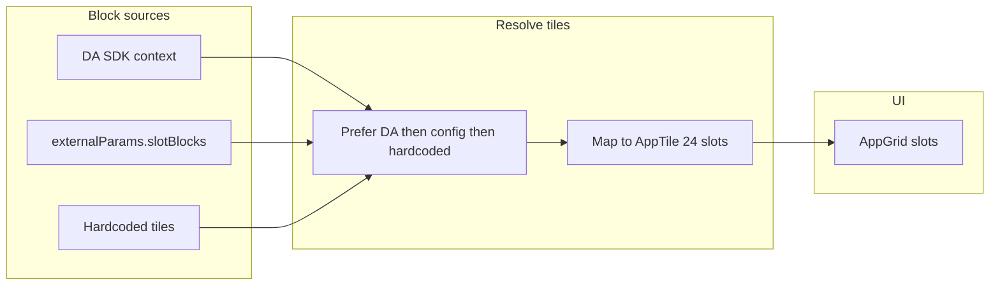

# Populate grid slots from DA live blocks

## Current state

- **Slots**: The 4×6 grid in [AppGrid.tsx](src/components/AppGrid.tsx) has 24 tile slots. Tiles are typed as `AppTile` (id, title, description, icon, onClick).
- **Data source**: Tiles are **hardcoded** in [MainApp.tsx](src/components/MainApp.tsx) via `useState<AppTile[]>` (Firefly, Experience Hub, AI Agents); remaining slots render as "Empty Slot".
- **No DA integration**: There is no use of DA.live or the [DA App SDK](https://docs.da.live/developers/guides/developing-apps-and-plugins) (PostMessage/context). [ExternalParams](src/types/index.ts) has no slot/block fields.

## Goal

Slots should be filled from **blocks** provided by the DA live page when the app is used at `https://da.live/#/eaplayground/awesomeportal` (or embedded elsewhere), with a clear contract for block shape and two integration paths.

## Approach

Support two ways for block data to reach the app, then derive `appTiles` from them in order of precedence:

1. **DA App SDK context** (when the app runs inside DA): Load the SDK, await `context`, and map a known context shape (e.g. `context.slotBlocks` or `context.blocks`) to `AppTile[]`.
2. **External config** (when embedded by any host, including DA): Read `window.awesomeportalConfig.externalParams.slotBlocks` (or `blocks`) and map to `AppTile[]`.
3. **Fallback**: Use the existing hardcoded tiles in MainApp when neither source provides data.

No change to the grid size (24 slots); extra blocks can be truncated, and missing slots stay as empty placeholders.

## Data contract

Define a **slot block** descriptor that can be provided by DA or config and mapped to `AppTile`:

- `id` (string, required)
- `title` (string, required)
- `description?` (string)
- `iconUrl?` (string) — image URL for the tile icon (AppGrid currently uses React nodes; support URL and optional inline SVG/key)
- `href?` (string) — optional link; if present, tile click can navigate or open
- `appId?` (string) — optional; if it matches a known app (e.g. `firefly`, `experience-hub`, `ai-agents`), use existing `onClick` behavior

Mapping: each slot block becomes one `AppTile` (id, title, description, icon from iconUrl or default, onClick from href/appId). Order of the array = order of slots (index 0 = first tile, etc.).

## Implementation plan

### 1. Types and config

- **Extend [ExternalParams**](src/types/index.ts) with an optional field, e.g. `slotBlocks?: SlotBlockDescriptor[]`.
- **Add a small type** (e.g. in `types/index.ts`) for `SlotBlockDescriptor`: id, title, description?, iconUrl?, href?, appId?.
- **Document the contract** (e.g. in README or a short comment in config) so DA or the embedding page knows what to pass.

### 2. External params as source

- In [MainApp.tsx](src/components/MainApp.tsx), compute tiles once (e.g. in a `useMemo` or at render) from `getExternalParams().slotBlocks` when present: map each descriptor to `AppTile` (resolve icon from `iconUrl` or a default/placeholder), and fill remaining slots up to 24 with `null` (so AppGrid keeps showing "Empty Slot").
- Merge or replace: decide whether to **replace** all tiles when `slotBlocks` is set, or **merge** (e.g. slotBlocks first, then hardcoded defaults). Recommendation: **replace** when `slotBlocks` is non-empty so DA has full control; otherwise use current hardcoded list.

### 3. DA App SDK integration (optional but recommended for da.live)

- **When to load**: Only when the app is likely inside DA (e.g. same-origin or referrer from `da.live`, or a new external param like `isDALiveEmbed?: boolean`). Alternatively, always try to load the SDK and use context only when it’s present.
- **How**: Add a small module or effect that:
  - Dynamically imports or loads `https://da.live/nx/utils/sdk.js` (or use a script tag in [index.html](index.html) when building for DA).
  - Awaits `DA_SDK` and reads `context`. If `context.slotBlocks` (or an agreed key) exists and is an array, use it as the slot source (same mapping as external params).
- **Precedence**: Prefer DA context over `externalParams.slotBlocks` when both exist so that the live page can override injected config.

### 4. AppGrid and MainApp

- **AppGrid**: No API change; it already accepts `tiles: (AppTile | null)[]` and renders 24 slots. Keep as is.
- **MainApp**: Replace the current `useState<AppTile[]>` for `appTiles` with a **derived** value: `tiles = useSlotBlocksFromDALiveOrConfig()` (or inline logic) that returns up to 24 `AppTile | null`, then pass `tiles={tiles}` to `AppGrid`. Preserve existing `onTileClick` behavior for known `appId`s (firefly, experience-hub, ai-agents) so that clicking those tiles still opens the correct sub-view.

### 5. Icon handling

- **AppTile** currently uses `icon?: React.ReactNode`. For block descriptors with `iconUrl`, either:
  - Render an `` in a small wrapper as the tile icon, or
  - Resolve a small set of known block types to the existing SVG icons. Prefer supporting `iconUrl` so DA can supply thumbnails or asset URLs without code changes.

## Flow (high level)

## Files to touch

| File                                                             | Change                                                                                                                                |
| ---------------------------------------------------------------- | ------------------------------------------------------------------------------------------------------------------------------------- |
| [src/types/index.ts](src/types/index.ts)                         | Add `SlotBlockDescriptor`, extend `ExternalParams` with `slotBlocks?`.                                                                |
| [src/utils/config.ts](src/utils/config.ts)                       | No change if we only read `getExternalParams()`; optional helper to normalize slot blocks.                                            |
| [src/components/MainApp.tsx](src/components/MainApp.tsx)         | Derive `appTiles` from slot blocks (DA context or externalParams), map to `AppTile[]`, keep `onTileClick` and known app routing.      |
| New (optional)                                                   | Small hook or util: `useSlotBlocks()` that returns resolved tiles (e.g. `useEffect` + state for DA SDK, or sync from externalParams). |
| [public/config.local.js.example](public/config.local.js.example) | Add example `slotBlocks` array so embedders know the contract.                                                                        |
| [index.html](index.html)                                         | Optional: add script tag for `sdk.js` when building for DA embed.                                                                     |

## Open decisions

1. **Exact context key**: DA’s `context` is generic. The plan assumes the DA side (or a wrapper at eaplayground/awesomeportal) will put slot data under a known key (e.g. `context.slotBlocks`). If DA provides a different structure, the mapping step will need to align (and possibly document the expected shape for the DA team).
2. **Auth**: DA App SDK also provides `token`; if tile actions need to call DA or authenticated APIs, the same token can be used later without changing the slot contract.
3. **Ref/local**: For local dev with DA, using `ref=local` and loading the app from localhost is already supported by DA; slot blocks could be mocked via `config.local.js` or a local override.

This keeps the current UX and grid behavior, adds a clear contract for slot content from DA live or any embedder, and avoids breaking existing standalone or block-integration usage.