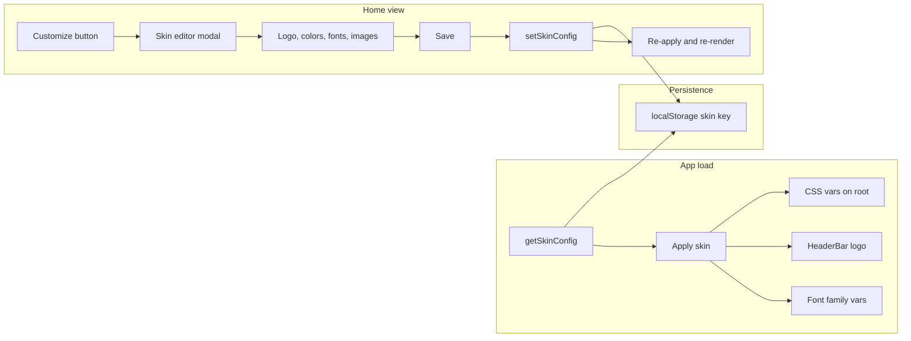

# Portal skinning feature

## Current state

- **Home view**: When no app is selected, [MainApp.tsx](awesomeportal-react/src/components/MainApp.tsx) renders [AppGrid](awesomeportal-react/src/components/AppGrid.tsx) (tile grid). This is the intended "home page" for the skin button.
- **Logo**: [HeaderBar.tsx](awesomeportal-react/src/components/HeaderBar.tsx) (lines 83–88) uses a fixed asset: `${import.meta.env.BASE_URL}android-chrome-192x192.png`, shown when `!isBlockIntegration`.
- **Theme**: [theme.css](awesomeportal-react/src/components/theme.css) defines CSS variables (`:root` and `@media (prefers-color-scheme: dark)`): `--background-color`, `--gray-*`, `--purple-*`, `--red-*`, and semantic vars (`--text-color`, `--link-color`, `--focus-ring-color`, etc.). [index.css](awesomeportal-react/src/index.css) adds `--primary-color`. [HeaderBar.css](awesomeportal-react/src/components/HeaderBar.css) and [AppGrid.css](awesomeportal-react/src/components/AppGrid.css) use `var(--primary-color, ...)`.
- **Config pattern**: [config.ts](awesomeportal-react/src/utils/config.ts) already has `getGridEditConfig` / `setGridEditConfig` (localStorage key `awesomeportal_gridEditConfig`) merged into `getExternalParams()`. Skin can follow the same pattern: a separate storage key and type, then applied at runtime.

## Architecture

- **Skin config**: New type (e.g. `PortalSkinConfig`) with optional: `logoUrl`, `primaryColor`, `backgroundColor`, `accentColor` (or map to existing theme vars), `fontFamilyBody`, `fontFamilyHeading`, optional `heroImageUrl` / `backgroundImageUrl` for the home area.
- **Storage**: New localStorage key (e.g. `awesomeportal_skinConfig`), separate from grid edit config. No change to `getExternalParams()` unless you prefer skin to be part of a single "portal config" blob later.
- **Application**: On load and when skin is saved: (1) Write CSS variable overrides to a `<style>` tag or a wrapper (e.g. `document.documentElement.style.setProperty`) for the vars you allow to be skinned. (2) HeaderBar reads logo from skin (or externalParams if you inject it there) and uses it when set. (3) Optional: load a Google Fonts (or similar) link when `fontFamilyHeading`/`fontFamilyBody` are set and set `--font-body` / `--font-heading` so existing theme/components can use them.

## Implementation plan

### 1. Types and config

- In [src/types/index.ts](awesomeportal-react/src/types/index.ts): Add `PortalSkinConfig` (e.g. `logoUrl?: string`, `primaryColor?: string`, `backgroundColor?: string`, `accentColor?: string`, `fontFamilyBody?: string`, `fontFamilyHeading?: string`, `heroImageUrl?: string`). Keep all optional so "no skin" = defaults.
- In [src/utils/config.ts](awesomeportal-react/src/utils/config.ts): Add `SKIN_STORAGE_KEY`, `getSkinConfig(): PortalSkinConfig | null`, `setSkinConfig(config: PortalSkinConfig): void`. Do **not** merge skin into `getExternalParams()` for now; skin will be read where needed (HeaderBar, and a small "skin applier" that runs once).

### 2. Applying the skin

- **Skin applier**: Add a small utility or hook that reads `getSkinConfig()` and applies overrides:
  - Set CSS custom properties on `document.documentElement` (e.g. `--primary-color`, `--background-color`, `--link-color`, `--focus-ring-color`, and any new vars like `--font-body`, `--font-heading`) from skin. Only set keys that are present in the skin config.
  - Optional: inject a `<link rel="stylesheet">` for Google Fonts when font families are set (e.g. `https://fonts.googleapis.com/css2?family=...`).
- Run this applier: (1) Once on app init (e.g. in [main.tsx](awesomeportal-react/src/main.tsx) after root render, or inside a top-level component that mounts once). (2) After the user saves in the skin editor (so the app re-reads skin and re-applies).
- **Logo**: In [HeaderBar.tsx](awesomeportal-react/src/components/HeaderBar.tsx), get skin config (via a hook that reads from localStorage + optional context, or from a thin context that provides `skinConfig`). If `skinConfig?.logoUrl` is set, use it as the `src` for the logo image; otherwise keep current `${import.meta.env.BASE_URL}android-chrome-192x192.png`.

### 3. Skin editor UI

- **Button**: Only on the home (AppGrid) view. In [MainApp.tsx](awesomeportal-react/src/components/MainApp.tsx), in the branch that renders `<AppGrid ... />`, add a "Customize" or "Skin portal" button (e.g. top-right of `.right-content-area` or above the grid). Use existing patterns (e.g. same style as other header/secondary actions).
- **Modal**: New component, e.g. `SkinEditorModal` (or `PortalSkinEditor`), that:
  - Shows when the button is clicked; has a close/cancel and a "Save" action.
  - **Logo**: Input for logo URL (text). Optional later: file upload that produces a data URL or uploads and stores URL.
  - **Colors**: Inputs for primary, background, and optionally accent (e.g. color type inputs or text hex). Label which part of the UI they affect.
  - **Fonts**: Two optional text inputs (or dropdowns with common choices): "Body font", "Heading font". Optional: "Load from Google Fonts" and inject link when saving.
  - **Images**: Optional field for "Hero / background image URL" for the home area (if you add a hero section or background to the grid container).
  - On Save: validate (e.g. URL format), call `setSkinConfig(...)`, run the skin applier, close modal, and optionally trigger a small state update so HeaderBar and any skin-dependent UI re-render (e.g. by storing skin in React state or context and updating it after save).
- **Reset**: Optional "Reset to default" that clears the skin config from localStorage and re-applies defaults (reload or re-run applier with no overrides).

### 4. Where to show the button and how to re-apply

- **Button placement**: In the `right-content-area` when the content is `<AppGrid ... />`. For example, wrap the grid in a fragment or div and add a header row that contains the "Customize" button so it’s only visible on the home (tiles) view.
- **Re-apply after save**: Either (1) reload the page after save, or (2) keep the applier in a function and call it after save, and ensure HeaderBar gets fresh skin (e.g. pass `skinConfig` from MainApp state that you update on save, or have HeaderBar read from a context that’s updated when skin is saved). Option (2) is smoother UX.

### 5. Context (optional but recommended)

- Add `skinConfig: PortalSkinConfig | null` and `setSkinConfig: (c: PortalSkinConfig | null) => void` to app context (e.g. extend [AppConfigContext](awesomeportal-react/src/contexts/AppConfigContext.ts) or add a small `SkinContext`). Provider initializes from `getSkinConfig()` on mount and runs the applier; when user saves in the modal, call `setSkinConfig` (and persist via `setSkinConfig` in config.ts), then run applier again. HeaderBar and any other component then use `useAppConfig()` or `useSkin()` to read the current skin (logo URL, etc.).

### 6. CSS variable mapping

- Map skin fields to existing or new variables, for example:
  - `primaryColor` → `--primary-color` (and optionally `--highlight-background` if you want buttons to follow)
  - `backgroundColor` → `--background-color`
  - `accentColor` → `--link-color`, `--focus-ring-color`
  - `fontFamilyBody` → `--font-body`; `fontFamilyHeading` → `--font-heading`
- Ensure [theme.css](awesomeportal-react/src/components/theme.css) (or a minimal override layer) uses `var(--font-body, ...)` and `var(--font-heading, ...)` with sensible fallbacks if you add font skinning. Same for components that should respect skinned colors (many already use `var(--primary-color)` or theme vars).

### 7. Files to add or touch

| Area      | Files                                                                                                                                                                                  |
| --------- | -------------------------------------------------------------------------------------------------------------------------------------------------------------------------------------- |
| Types     | [src/types/index.ts](awesomeportal-react/src/types/index.ts) – add `PortalSkinConfig`                                                                                                  |
| Config    | [src/utils/config.ts](awesomeportal-react/src/utils/config.ts) – skin get/set and storage key                                                                                          |
| Apply     | New util or hook, e.g. `src/utils/applySkin.ts` or `src/hooks/useSkinApplier.ts` – read skin, set documentElement style and optional font link                                         |
| Context   | [src/contexts/AppConfigContext.ts](awesomeportal-react/src/contexts/AppConfigContext.ts) + provider – add `skinConfig` and setter; init and re-run applier on set                      |
| HeaderBar | [src/components/HeaderBar.tsx](awesomeportal-react/src/components/HeaderBar.tsx) – use `skinConfig.logoUrl` when present                                                               |
| MainApp   | [src/components/MainApp.tsx](awesomeportal-react/src/components/MainApp.tsx) – show "Customize" only when rendering AppGrid; open modal; on save update context and run applier        |
| Modal     | New [src/components/SkinEditorModal.tsx](awesomeportal-react/src/components/SkinEditorModal.tsx) (and optional .css) – form for logo, colors, fonts, images; Save/Reset                |
| Theme/CSS | [src/components/theme.css](awesomeportal-react/src/components/theme.css) or [index.css](awesomeportal-react/src/index.css) – optional `var(--font-body, ...)` if you add font skinning |

### 8. Scope and UX notes

- **Logo**: URL only in v1 (no file upload) keeps implementation simple; you can add file upload later (e.g. upload to a backend or store as data URL).
- **Colors**: Start with primary and background; add accent/link if needed. Use native `<input type="color">` plus a hex text input for accessibility.
- **Fonts**: Free-text or a short list of Google Fonts; inject one stylesheet when both body and heading are set.
- **Images**: Optional hero/background URL for the home section; apply via a wrapper div with `background-image` or an `` in the grid top area (similar to existing `gridTopBanners`).
- **Persistence**: localStorage only; no backend required. If the app is embedded (e.g. `isBlockIntegration`), consider whether skin should be disabled or still allowed (current logo is already hidden when `isBlockIntegration` is true).

This gives a single "Customize" entry point on the home page, a simple modal to set logo, colors, fonts, and optional images, with skin persisted and applied globally via existing (and a few new) CSS variables and HeaderBar logo swap.